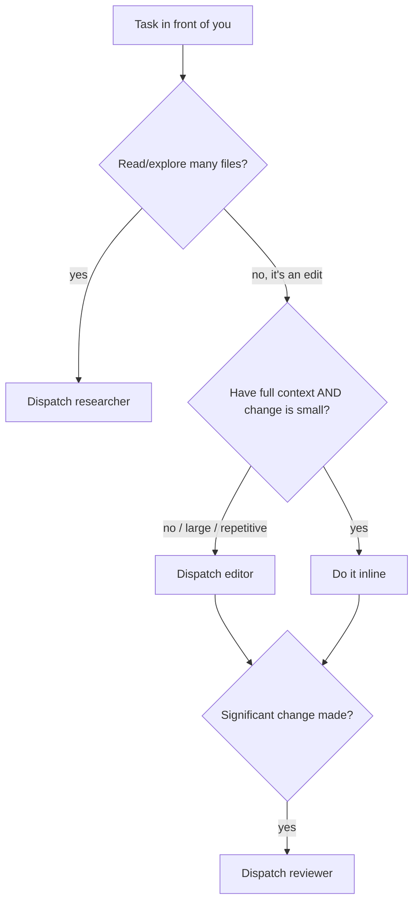

# Orchestrator

## Overview

Delegate heavy work to opencode subagents to preserve your own context budget. You stay the planner/driver; opencode burns its own context on file traversal, edits, and review. **Degrees of Freedom: Medium** — dispatch mechanics are fixed; whether to dispatch is your judgment.

Core principle: **your context is the scarce resource.** If a task would load lots of file content or diffs into your window, push it to a subagent and receive only the summary.

## Prerequisites

- `opencode` CLI on PATH. `jq` for extracting the answer from JSON events.
- The `researcher`, `editor`, and `reviewer` agents installed in an opencode discovery path (`~/.config/opencode/agent/` or a project's `.opencode/agent/`); source defs live in this repo's `subagents/`. They must be `mode: all` — `mode: subagent` agents are NOT dispatchable via `opencode run` (it falls back to the default agent).

## When to Use vs. Work Inline



- **Research:** almost always dispatch — context savings are immediate, overhead is low.
- **Edit:** dispatch when the change is large, repetitive, multi-file, or its context already lives in a subagent. Do it inline when you already hold the context and the change is small.
- **Review:** dispatch after any non-trivial edit (yours or the editor's). Skip for trivial changes.

## The Subagents

| Agent | Role | Can edit? | Model |
|-------|------|-----------|-------|
| `researcher` | Explore, locate files, trace usage, summarise | No (read-only) | `opencode/deepseek-v4-flash-free` |
| `editor` | Make a precise, scoped edit | Yes | `opencode/deepseek-v4-flash-free` |
| `reviewer` | Review a diff, report issues by severity | No (read-only) | `opencode/deepseek-v4-flash-free` |

Read-only agents are read-only by permission — a bad prompt cannot corrupt files.

## Dispatch Command

One template for all three — swap the agent name, `--dir`, and prompt. The model is pinned in each agent file, so no `--model`:

```bash
opencode run --agent <researcher|editor|reviewer> --format json --dir <repo-path> "<prompt>" \
  | jq -r 'select(.type=="text") | .part.text'
```

- `--format json` + the `jq` filter return only the final answer text.
- Attach a file with `--file/-f <path>`; continue a session with `--session/-s <id>` (the id appears in the JSON events).
- Run several dispatches in parallel (independent tasks) by issuing multiple shell calls at once.
- To inspect what the editor changed, drop the `jq` filter and read `tool_use` events.

## Writing the Prompt (this is where dispatches fail)

The invocation rarely fails; vague prompts do. Include:

- **researcher:** the exact question + what to return ("return only the file path", "summarise X, Y, Z as a table"). Tell it to say so if something doesn't exist.
- **editor:** the **exact file path**, the **exact change**, and **what NOT to touch**. If you can't state the change precisely, you're not ready to dispatch — clarify first.
- **reviewer:** what changed and what to check ("review the git diff for correctness and scope creep").

## Common Mistakes

### Rationalizations that defeat dispatching

These thoughts are traps. Recognise them and dispatch anyway:

| Rationalization | Why it's a trap |
|----------------|-----------------|
| "It's only a few files, I'll just read them myself" | Those files fill your context window. A researcher returns just the summary. |
| "The edit is small, faster to do inline" | "Small" compounds across the session. Every inline edit adds file content + diff to your context. |
| "I need to see the content to know what to ask" | Ask the researcher a broad question first. Its answer lets you refine without loading files. |
| "Dispatching takes longer than doing it" | Cold dispatch adds ~5s overhead. Inline reading + reasoning costs more for anything beyond 1 file. |
| "I already have the context from an earlier step" | That context is still occupying space. Free it by dispatching follow-ups. |

### Other mistakes

- Vague editor prompts ("clean up the config") — the editor guesses. Be exact.
- Forgetting `--dir` — the subagent runs in the wrong tree and finds nothing.
- An agent saved as `mode: subagent` — `opencode run` silently falls back to the default (editing) agent. Agents must be `mode: all`.
- Trusting a non-trivial edit blind — dispatch `reviewer` or read the diff before accepting.

## Design Note

Raw commands live here intentionally (no wrapper script) — the pipeline is short and per-dispatch flags must stay visible. If retry logic or session chaining becomes routine, extract `scripts/dispatch.sh` then.
